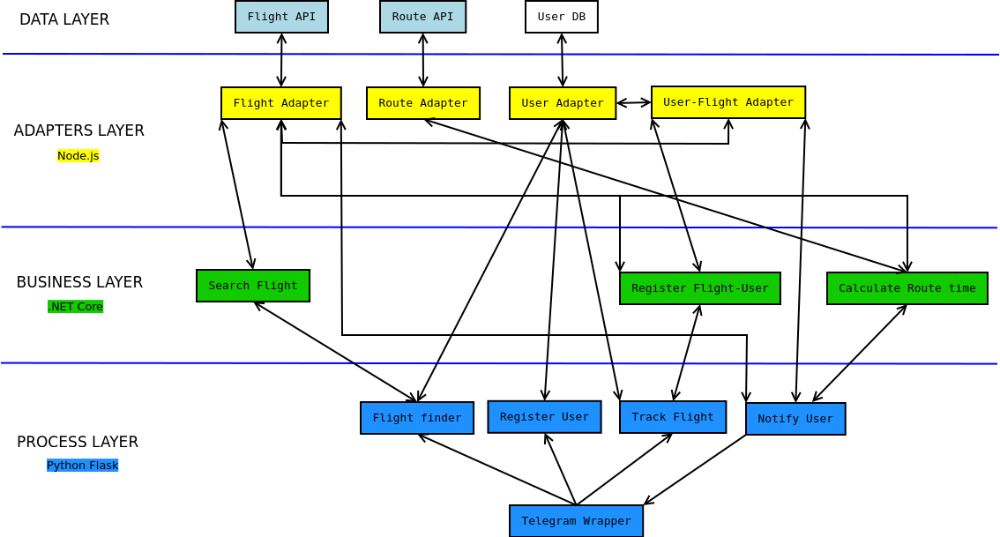

# SDE flight tracker bot

Project for the SDE course at UniTN 2019.

This project is a microservice architecture that implements a Telegram bot capable to track flights and notify you about them.

## Project structure

## Documentation
Data layer:
- Flight API (Lufthansa API)
- Route API (openrouteservice)
- User DB (PostgreSQL)

Adapter layer:
- [Flight adapter](https://petstore.swagger.io/?url=https://raw.githubusercontent.com/davidezanella/SDE_flight_tracker_bot/master/adapter_services_layer/flight_adapter/swagger.yaml)
- [Route adapter](https://petstore.swagger.io/?url=https://raw.githubusercontent.com/davidezanella/SDE_flight_tracker_bot/master/adapter_services_layer/route_adapter/swagger.yaml)
- [User adapter](https://petstore.swagger.io/?url=https://raw.githubusercontent.com/davidezanella/SDE_flight_tracker_bot/master/adapter_services_layer/user_adapter/swagger.yaml)
- [User-flight adapter](https://petstore.swagger.io/?url=https://raw.githubusercontent.com/davidezanella/SDE_flight_tracker_bot/master/adapter_services_layer/user-flight_adapter/swagger.yaml)

Business layer:
- [Search flight](https://petstore.swagger.io/?url=https://raw.githubusercontent.com/davidezanella/SDE_flight_tracker_bot/master/business_services_layer/search_flight/swagger.yaml)
- [Register flight-user](https://petstore.swagger.io/?url=https://raw.githubusercontent.com/davidezanella/SDE_flight_tracker_bot/master/business_services_layer/register_flight-user/swagger.yaml)
- [Calculate route time](https://petstore.swagger.io/?url=https://raw.githubusercontent.com/davidezanella/SDE_flight_tracker_bot/master/business_services_layer/calculate_route_time/swagger.yaml)

Process layer:
- [Flight finder](https://petstore.swagger.io/?url=https://raw.githubusercontent.com/davidezanella/SDE_flight_tracker_bot/master/process_services_layer/flight_finder/swagger.yaml)
- [Register user](https://petstore.swagger.io/?url=https://raw.githubusercontent.com/davidezanella/SDE_flight_tracker_bot/master/process_services_layer/register_user/swagger.yaml)
- [Track flight](https://petstore.swagger.io/?url=https://raw.githubusercontent.com/davidezanella/SDE_flight_tracker_bot/master/process_services_layer/track_flight/swagger.yaml)
- [Notificate user](https://petstore.swagger.io/?url=https://raw.githubusercontent.com/davidezanella/SDE_flight_tracker_bot/master/process_services_layer/notificate_user/swagger.yaml)

- [Telegram wrapper](https://petstore.swagger.io/?url=https://raw.githubusercontent.com/davidezanella/SDE_flight_tracker_bot/master/process_services_layer/telegram_wrapper/swagger.yaml)